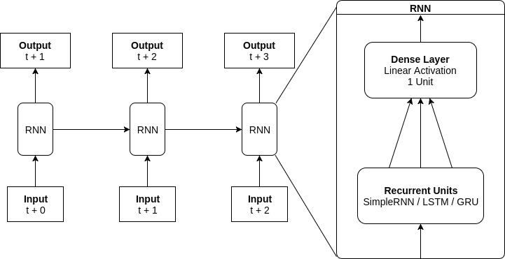
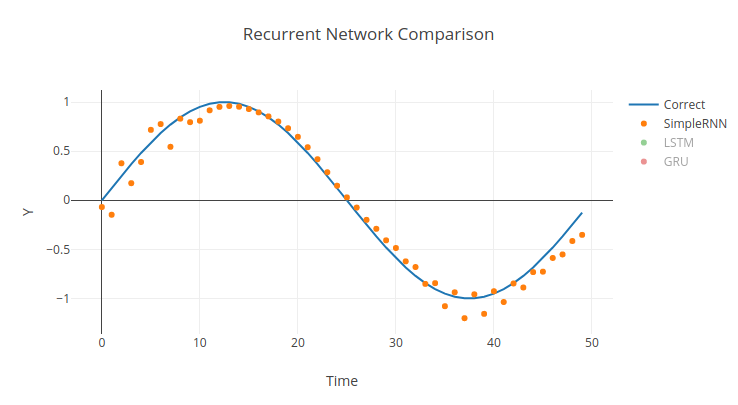
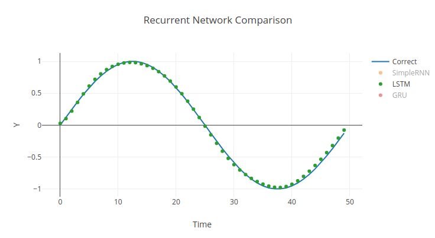
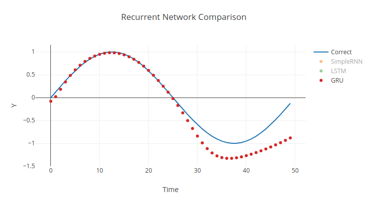
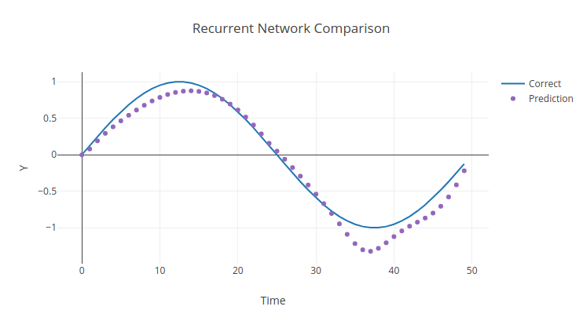

# RNN Demo #

This is a demo of using recurrent neural networks to make realtime predictions (generating outputs from a streaming input). Traditionally, RNNs are trained on an input of a single time series of a fixed size. The problem is that often the data is received piece by piece. This demo uses stateful networks with a batch size of 1 to make realtime predictions based on a streaming input. It also compares different recurrent network using the default parameters in Keras.

The network is trained on a full period of sine. During testing, for the first half of the graph the network is fed the correct data. For the second half, it bases its new predictions only on its own previous predictions. Below is the general architecture:



## Usage ##

```
Usage: ./rnn_demo.py SimpleRNN|LSTM|GRU [units] [epochs] [resolution] [should_reset]
```

To visualize the output, I recommend pasting the data into [plot.ly](https://plot.ly/create/).

## Results ##

**Fully Recurrent Network:**

Being the most basic recurrent network, it still can learn the sine wave, but stuggles a little at the extrema. Sometimes it predicts a smoother curve, but it always strays a little from the curve.

```
./rnn_demo.py SimpleRNN 10 60 50 False
```




**Long Short Term Memory:**

Using gates to conditionally persist states across larger timesteps, the LSTM cells are able to almost perfectly represent the data.

```
./rnn_demo.py LSTM 10 60 50 False
```



**Gated Recurrent Unit:**

Similar to an LSTM, a GRU uses gates to retain states. However, since it doesn't have an output gate it cannot conditionally choose to inhibit it's own output. Whether because of this or something else, GRUs consistently fail to learn the last part of the sine wave.

```
./rnn_demo.py GRU 10 60 50 False
```



**Resetting States:**

In the previous examples, while training and testing, the internal states were never reset. To the network, it saw a continuous sine wave. In this example, after each period the internal states are reset to prevent dependency forming between the end and beginning of the dataset. As expected, the accuracy decreases slightly, especially towards the end.

```
./rnn_demo.py LSTM 10 60 50 True
```




